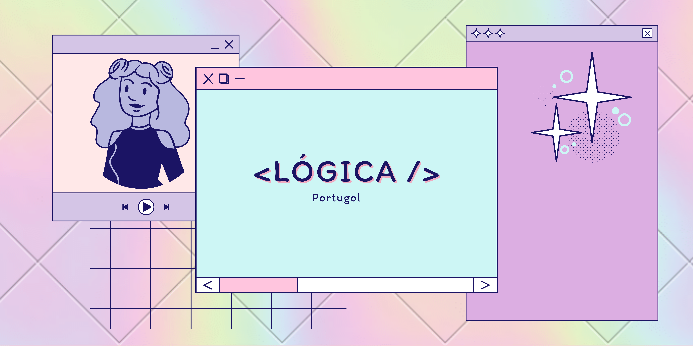

> 📚🅰️➡️🅱️ 19 Exercícios

## ✏️ Sobre o repositorio

O meu primeiro contato com programação foi através do instituto PROA e pratiquei lógica de programação no Portugol,
Então resolvi deixar aqui alguns dos exercícios concluídos por min.

---------------------------

Feito com :hearts: por <a href="https://github.com/yasxxv">yasxxv</a>
